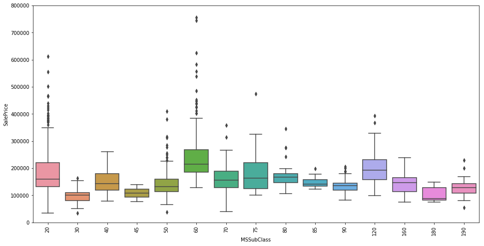
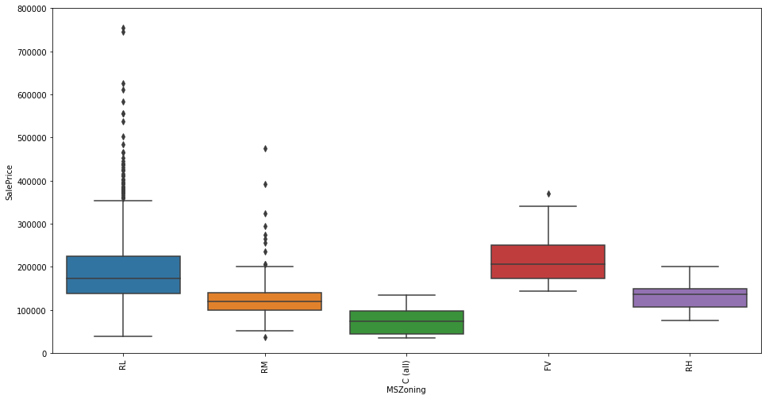

# Exploratory Data Analysis

## Importing all libraries


```python
import pandas as pd
import matplotlib.pyplot as plt
import seaborn as sns
import numpy as np
%matplotlib inline

import warnings
warnings.filterwarnings('ignore')
```

## Loading the data


```python
df_train = pd.read_csv('../../data/raw/train.csv')
df_train.set_index('Id', inplace = True)
```

## Looking at a few records


```python
df_train.head(10)
```


<div>
<style scoped>
    .dataframe tbody tr th:only-of-type {
        vertical-align: middle;
    }

    .dataframe tbody tr th {
        vertical-align: top;
    }

    .dataframe thead th {
        text-align: right;
    }
</style>
<table border="1" class="dataframe">
  <thead>
    <tr style="text-align: right;">
      <th></th>
      <th>MSSubClass</th>
      <th>MSZoning</th>
      <th>LotFrontage</th>
      <th>LotArea</th>
      <th>Street</th>
      <th>Alley</th>
      <th>LotShape</th>
      <th>LandContour</th>
      <th>Utilities</th>
      <th>LotConfig</th>
      <th>...</th>
      <th>PoolArea</th>
      <th>PoolQC</th>
      <th>Fence</th>
      <th>MiscFeature</th>
      <th>MiscVal</th>
      <th>MoSold</th>
      <th>YrSold</th>
      <th>SaleType</th>
      <th>SaleCondition</th>
      <th>SalePrice</th>
    </tr>
    <tr>
      <th>Id</th>
      <th></th>
      <th></th>
      <th></th>
      <th></th>
      <th></th>
      <th></th>
      <th></th>
      <th></th>
      <th></th>
      <th></th>
      <th></th>
      <th></th>
      <th></th>
      <th></th>
      <th></th>
      <th></th>
      <th></th>
      <th></th>
      <th></th>
      <th></th>
      <th></th>
    </tr>
  </thead>
  <tbody>
    <tr>
      <th>1</th>
      <td>60</td>
      <td>RL</td>
      <td>65.0</td>
      <td>8450</td>
      <td>Pave</td>
      <td>NaN</td>
      <td>Reg</td>
      <td>Lvl</td>
      <td>AllPub</td>
      <td>Inside</td>
      <td>...</td>
      <td>0</td>
      <td>NaN</td>
      <td>NaN</td>
      <td>NaN</td>
      <td>0</td>
      <td>2</td>
      <td>2008</td>
      <td>WD</td>
      <td>Normal</td>
      <td>208500</td>
    </tr>
    <tr>
      <th>2</th>
      <td>20</td>
      <td>RL</td>
      <td>80.0</td>
      <td>9600</td>
      <td>Pave</td>
      <td>NaN</td>
      <td>Reg</td>
      <td>Lvl</td>
      <td>AllPub</td>
      <td>FR2</td>
      <td>...</td>
      <td>0</td>
      <td>NaN</td>
      <td>NaN</td>
      <td>NaN</td>
      <td>0</td>
      <td>5</td>
      <td>2007</td>
      <td>WD</td>
      <td>Normal</td>
      <td>181500</td>
    </tr>
    <tr>
      <th>3</th>
      <td>60</td>
      <td>RL</td>
      <td>68.0</td>
      <td>11250</td>
      <td>Pave</td>
      <td>NaN</td>
      <td>IR1</td>
      <td>Lvl</td>
      <td>AllPub</td>
      <td>Inside</td>
      <td>...</td>
      <td>0</td>
      <td>NaN</td>
      <td>NaN</td>
      <td>NaN</td>
      <td>0</td>
      <td>9</td>
      <td>2008</td>
      <td>WD</td>
      <td>Normal</td>
      <td>223500</td>
    </tr>
    <tr>
      <th>4</th>
      <td>70</td>
      <td>RL</td>
      <td>60.0</td>
      <td>9550</td>
      <td>Pave</td>
      <td>NaN</td>
      <td>IR1</td>
      <td>Lvl</td>
      <td>AllPub</td>
      <td>Corner</td>
      <td>...</td>
      <td>0</td>
      <td>NaN</td>
      <td>NaN</td>
      <td>NaN</td>
      <td>0</td>
      <td>2</td>
      <td>2006</td>
      <td>WD</td>
      <td>Abnorml</td>
      <td>140000</td>
    </tr>
    <tr>
      <th>5</th>
      <td>60</td>
      <td>RL</td>
      <td>84.0</td>
      <td>14260</td>
      <td>Pave</td>
      <td>NaN</td>
      <td>IR1</td>
      <td>Lvl</td>
      <td>AllPub</td>
      <td>FR2</td>
      <td>...</td>
      <td>0</td>
      <td>NaN</td>
      <td>NaN</td>
      <td>NaN</td>
      <td>0</td>
      <td>12</td>
      <td>2008</td>
      <td>WD</td>
      <td>Normal</td>
      <td>250000</td>
    </tr>
    <tr>
      <th>6</th>
      <td>50</td>
      <td>RL</td>
      <td>85.0</td>
      <td>14115</td>
      <td>Pave</td>
      <td>NaN</td>
      <td>IR1</td>
      <td>Lvl</td>
      <td>AllPub</td>
      <td>Inside</td>
      <td>...</td>
      <td>0</td>
      <td>NaN</td>
      <td>MnPrv</td>
      <td>Shed</td>
      <td>700</td>
      <td>10</td>
      <td>2009</td>
      <td>WD</td>
      <td>Normal</td>
      <td>143000</td>
    </tr>
    <tr>
      <th>7</th>
      <td>20</td>
      <td>RL</td>
      <td>75.0</td>
      <td>10084</td>
      <td>Pave</td>
      <td>NaN</td>
      <td>Reg</td>
      <td>Lvl</td>
      <td>AllPub</td>
      <td>Inside</td>
      <td>...</td>
      <td>0</td>
      <td>NaN</td>
      <td>NaN</td>
      <td>NaN</td>
      <td>0</td>
      <td>8</td>
      <td>2007</td>
      <td>WD</td>
      <td>Normal</td>
      <td>307000</td>
    </tr>
    <tr>
      <th>8</th>
      <td>60</td>
      <td>RL</td>
      <td>NaN</td>
      <td>10382</td>
      <td>Pave</td>
      <td>NaN</td>
      <td>IR1</td>
      <td>Lvl</td>
      <td>AllPub</td>
      <td>Corner</td>
      <td>...</td>
      <td>0</td>
      <td>NaN</td>
      <td>NaN</td>
      <td>Shed</td>
      <td>350</td>
      <td>11</td>
      <td>2009</td>
      <td>WD</td>
      <td>Normal</td>
      <td>200000</td>
    </tr>
    <tr>
      <th>9</th>
      <td>50</td>
      <td>RM</td>
      <td>51.0</td>
      <td>6120</td>
      <td>Pave</td>
      <td>NaN</td>
      <td>Reg</td>
      <td>Lvl</td>
      <td>AllPub</td>
      <td>Inside</td>
      <td>...</td>
      <td>0</td>
      <td>NaN</td>
      <td>NaN</td>
      <td>NaN</td>
      <td>0</td>
      <td>4</td>
      <td>2008</td>
      <td>WD</td>
      <td>Abnorml</td>
      <td>129900</td>
    </tr>
    <tr>
      <th>10</th>
      <td>190</td>
      <td>RL</td>
      <td>50.0</td>
      <td>7420</td>
      <td>Pave</td>
      <td>NaN</td>
      <td>Reg</td>
      <td>Lvl</td>
      <td>AllPub</td>
      <td>Corner</td>
      <td>...</td>
      <td>0</td>
      <td>NaN</td>
      <td>NaN</td>
      <td>NaN</td>
      <td>0</td>
      <td>1</td>
      <td>2008</td>
      <td>WD</td>
      <td>Normal</td>
      <td>118000</td>
    </tr>
  </tbody>
</table>
<p>10 rows × 80 columns</p>
</div>


# Looking at the response variable


```python
#Brief statistics
df_train['SalePrice'].describe()
```


    count      1460.000000
    mean     180921.195890
    std       79442.502883
    min       34900.000000
    25%      129975.000000
    50%      163000.000000
    75%      214000.000000
    max      755000.000000
    Name: SalePrice, dtype: float64


We do not have any missing or erroneous values in the response variable


```python
#Looking at the histogram
sns.distplot(df_train['SalePrice'])
```


    <matplotlib.axes._subplots.AxesSubplot at 0x159bf0a8c88>


A majority of the houses lie in the bracket of [100,000 to 400,000] with a longer right tail indicating a few high-value houses. The distribution is normal with a little bit of positive skewness.

## Relationship with numerical variables


```python
#scatter plot grlivarea/saleprice
var = 'GrLivArea'
data = pd.concat([df_train['SalePrice'], df_train[var]], axis=1)
data.plot.scatter(x=var, y='SalePrice', ylim=(0,800000));
```


The SalePrice seems to have a positive correlation with Above grade (ground) living area square feet. 


```python
#scatter plot totalbsmtsf/saleprice
var = 'TotalBsmtSF'
data = pd.concat([df_train['SalePrice'], df_train[var]], axis=1)
data.plot.scatter(x=var, y='SalePrice', ylim=(0,800000));
```


As we can see, there are a few houses with 0 Total basement square feet area. These are the houses with no basements. But, as we see, as the total basement area increases, the salePrice increases. It seems to follow a linear relationship

## Relationship with categorical features


```python
#box plot overallqual/saleprice
var = 'OverallQual'
data = pd.concat([df_train['SalePrice'], df_train[var]], axis=1)
f, ax = plt.subplots(figsize=(8, 6))
fig = sns.boxplot(x=var, y="SalePrice", data=data)
fig.axis(ymin=0, ymax=800000);
```


As it is obvious, the salePrice is naturally higher for houses with better overall quality scores


```python
#Looking at whether the year of build has any impact
var = 'YearBuilt'
data = pd.concat([df_train['SalePrice'], df_train[var]], axis=1)
f, ax = plt.subplots(figsize=(16, 8))
fig = sns.boxplot(x=var, y="SalePrice", data=data)
fig.axis(ymin=0, ymax=800000);
plt.xticks(rotation=90);
```


The Year built does not seem to have any significant impact on the salePrice of the house


```python
#Looking at whether the MSSubClass has any impact
var = 'MSSubClass'
data = pd.concat([df_train['SalePrice'], df_train[var]], axis=1)
f, ax = plt.subplots(figsize=(16, 8))
fig = sns.boxplot(x=var, y="SalePrice", data=data)
fig.axis(ymin=0, ymax=800000);
plt.xticks(rotation=90);
```





        20	1-STORY 1946 & NEWER ALL STYLES
        30	1-STORY 1945 & OLDER
        40	1-STORY W/FINISHED ATTIC ALL AGES
        45	1-1/2 STORY - UNFINISHED ALL AGES
        50	1-1/2 STORY FINISHED ALL AGES
        60	2-STORY 1946 & NEWER
        70	2-STORY 1945 & OLDER
        75	2-1/2 STORY ALL AGES
        80	SPLIT OR MULTI-LEVEL
        85	SPLIT FOYER
        90	DUPLEX - ALL STYLES AND AGES
       120	1-STORY PUD (Planned Unit Development) - 1946 & NEWER
       150	1-1/2 STORY PUD - ALL AGES
       160	2-STORY PUD - 1946 & NEWER
       180	PUD - MULTILEVEL - INCL SPLIT LEV/FOYER
       190	2 FAMILY CONVERSION - ALL STYLES AND AGES
As it is seen, Buildings built after 1946 generally tend to have higher prices than older buildings


```python
#Looking at whether the Zonnal Classification has any impact
var = 'MSZoning'
data = pd.concat([df_train['SalePrice'], df_train[var]], axis=1)
f, ax = plt.subplots(figsize=(16, 8))
fig = sns.boxplot(x=var, y="SalePrice", data=data)
fig.axis(ymin=0, ymax=800000);
plt.xticks(rotation=90);
```





We can see that as the population density reduces, the prices of the houses increase


```python
#Looking at whether the Zonnal Classification has any impact
var = 'Neighborhood'
data = pd.concat([df_train['SalePrice'], df_train[var]], axis=1)
f, ax = plt.subplots(figsize=(16, 8))
fig = sns.boxplot(x=var, y="SalePrice", data=data)
fig.axis(ymin=0, ymax=800000);
plt.xticks(rotation=90);
```


There clearly are a few neighborhoods that are more expensive than others. Nridght, Crawfor and StoneBr seem to be the most expensive on an average

## Looking at correlations between the variables


```python
#correlation matrix
corrmat = df_train.corr()
f, ax = plt.subplots(figsize=(12, 9))
sns.heatmap(corrmat, vmax=.8, square=True);
```


Looking at the correlations of our response variable SalePrice with all the variables, we see that the highest correlations are with OverallQual, GrLivArea (Above ground living are), TotalBsmtSF (Total Basement Area), 1stFlrSF (First floor area), FullBath (Full bathrooms above grade), GarageCars and GarageArea. Furthermore, the following set of response variables have high correlations between them:

- TotalBSMTSF and 1stFlrSR 
- GarageCars and GarageArea
- GarageYrBuilt and YearBuilt

Including both variables in our model amongst the above sets may lead to multi-dimensionality problems while modelling.

## looking at the top 10 correlations with the response variable


```python
#saleprice correlation matrix
k = 10 #number of variables for heatmap
cols = corrmat.nlargest(k, 'SalePrice')['SalePrice'].index
cm = np.corrcoef(df_train[cols].values.T)
sns.set(font_scale=1.25)
hm = sns.heatmap(cm, cbar=True, annot=True, square=True, fmt='.2f', annot_kws={'size': 10}, yticklabels=cols.values, xticklabels=cols.values)
plt.show()
```


## Scatter plots between the top 10 correlated and response variable


```python
#scatterplot
sns.set()
cols = ['SalePrice', 'OverallQual', 'GrLivArea', 'GarageCars', 'TotalBsmtSF', 'FullBath', 'YearBuilt']
sns.pairplot(df_train[cols], size = 2.5)
plt.show();
```


## Looking at missing data


```python
#missing data
total = df_train.isnull().sum().sort_values(ascending=False)
percent = (df_train.isnull().sum()/df_train.isnull().count()).sort_values(ascending=False)
missing_data = pd.concat([total, percent], axis=1, keys=['Total', 'Percent'])
missing_data.head(20)
```


<div>
<style scoped>
    .dataframe tbody tr th:only-of-type {
        vertical-align: middle;
    }

    .dataframe tbody tr th {
        vertical-align: top;
    }

    .dataframe thead th {
        text-align: right;
    }
</style>
<table border="1" class="dataframe">
  <thead>
    <tr style="text-align: right;">
      <th></th>
      <th>Total</th>
      <th>Percent</th>
    </tr>
  </thead>
  <tbody>
    <tr>
      <th>PoolQC</th>
      <td>1453</td>
      <td>0.995205</td>
    </tr>
    <tr>
      <th>MiscFeature</th>
      <td>1406</td>
      <td>0.963014</td>
    </tr>
    <tr>
      <th>Alley</th>
      <td>1369</td>
      <td>0.937671</td>
    </tr>
    <tr>
      <th>Fence</th>
      <td>1179</td>
      <td>0.807534</td>
    </tr>
    <tr>
      <th>FireplaceQu</th>
      <td>690</td>
      <td>0.472603</td>
    </tr>
    <tr>
      <th>LotFrontage</th>
      <td>259</td>
      <td>0.177397</td>
    </tr>
    <tr>
      <th>GarageType</th>
      <td>81</td>
      <td>0.055479</td>
    </tr>
    <tr>
      <th>GarageCond</th>
      <td>81</td>
      <td>0.055479</td>
    </tr>
    <tr>
      <th>GarageFinish</th>
      <td>81</td>
      <td>0.055479</td>
    </tr>
    <tr>
      <th>GarageQual</th>
      <td>81</td>
      <td>0.055479</td>
    </tr>
    <tr>
      <th>GarageYrBlt</th>
      <td>81</td>
      <td>0.055479</td>
    </tr>
    <tr>
      <th>BsmtFinType2</th>
      <td>38</td>
      <td>0.026027</td>
    </tr>
    <tr>
      <th>BsmtExposure</th>
      <td>38</td>
      <td>0.026027</td>
    </tr>
    <tr>
      <th>BsmtQual</th>
      <td>37</td>
      <td>0.025342</td>
    </tr>
    <tr>
      <th>BsmtCond</th>
      <td>37</td>
      <td>0.025342</td>
    </tr>
    <tr>
      <th>BsmtFinType1</th>
      <td>37</td>
      <td>0.025342</td>
    </tr>
    <tr>
      <th>MasVnrArea</th>
      <td>8</td>
      <td>0.005479</td>
    </tr>
    <tr>
      <th>MasVnrType</th>
      <td>8</td>
      <td>0.005479</td>
    </tr>
    <tr>
      <th>Electrical</th>
      <td>1</td>
      <td>0.000685</td>
    </tr>
    <tr>
      <th>RoofMatl</th>
      <td>0</td>
      <td>0.000000</td>
    </tr>
  </tbody>
</table>
</div>


There are a few variables that have a very high percentage of missing data. A quick look at the data dictionary reveals that the data is structurally missing, and hence will be imputed appropriately. Eg. 93.7% of the records have missing Alley. This implies that 93.7% of all the houses do not have alley access. Similarly, 5.54% of houses in our dataset do not have a garage
